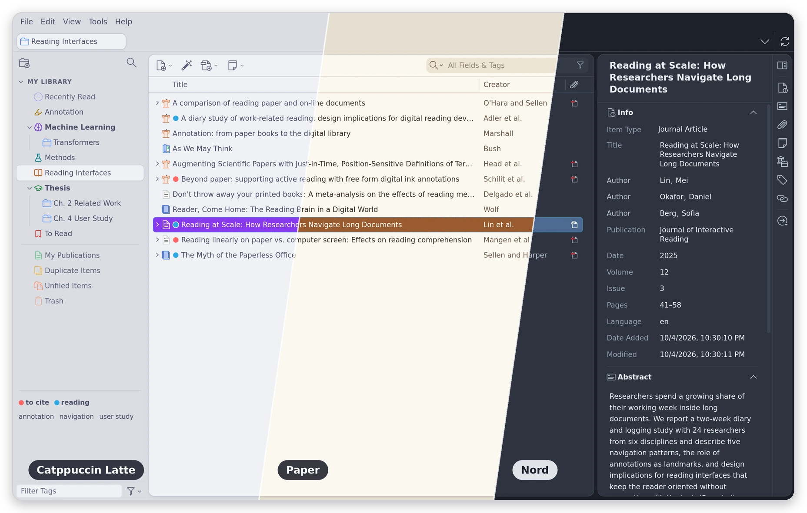
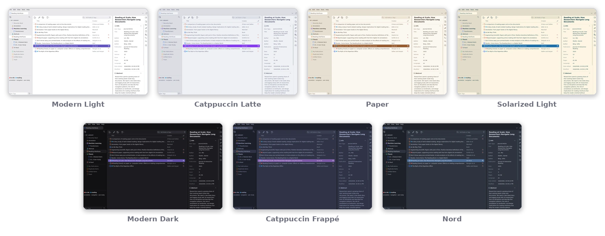
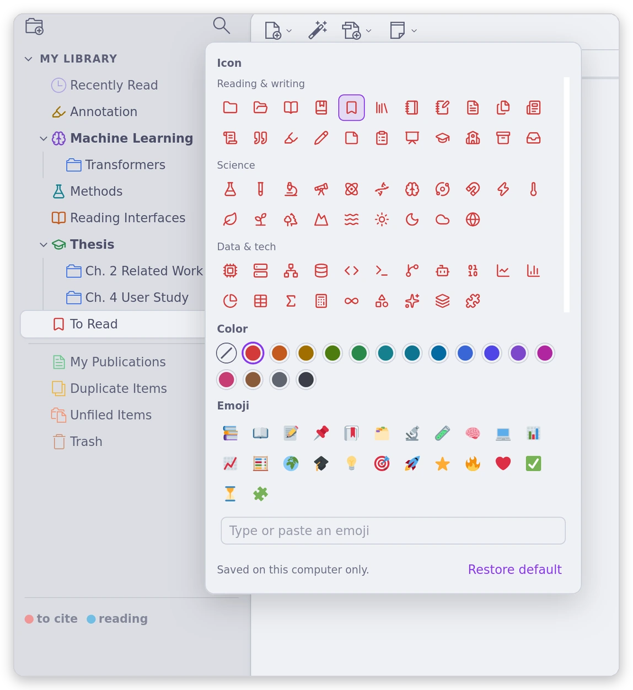
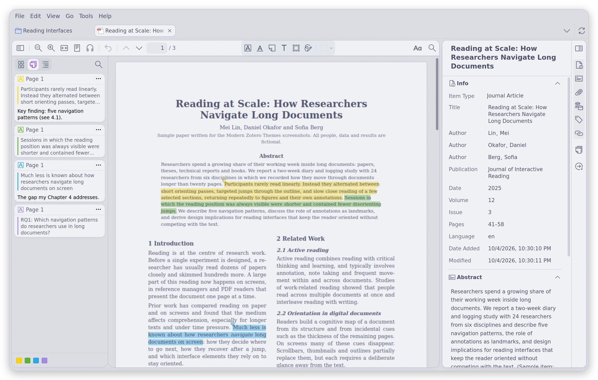
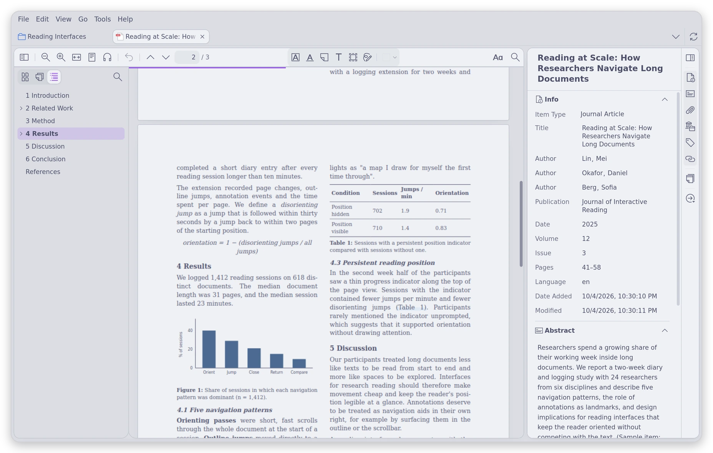
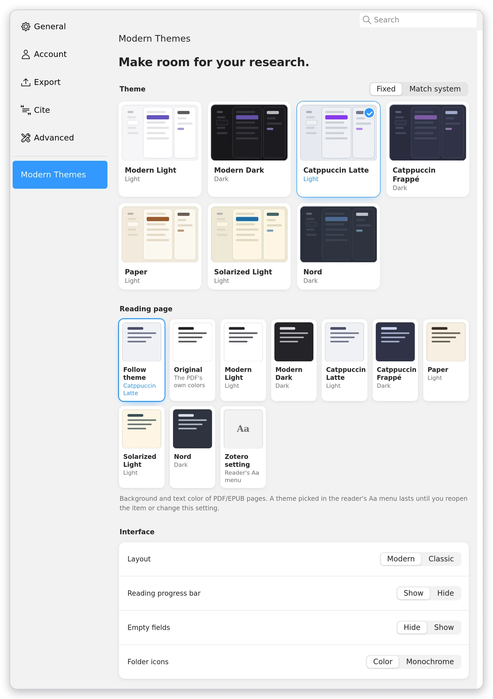

# Modern Zotero Themes

**English** | [简体中文](README.zh-CN.md)

Modern themes for Zotero 7–10. Zotero's three panes, toolbars and workflow stay where they are.



## Features

### Themes



### Modern layout

- The item list and the item pane float as two rounded cards on a shared canvas.
- Pill-shaped tabs, a filled search field and a roomier item pane.
- Empty fields stay hidden until you edit the Info section.
- Prefer Zotero's own layout? Switch to "Classic" in the settings to change colors only.

### Collection tree and custom icons



- Library names become section headings, nested collections get indent guides, and built-in rows such as Trash are dimmed.
- Right-click a collection → "Set Icon…" to pick one of 105 line icons (in 16 colors) or any emoji.
- Icons are saved on this computer only and don't sync.

### Reader

 

- The toolbar, sidebar, annotation cards and popups use the theme's colors. Annotation colors are never changed.
- Reading page: give PDF/EPUB pages a theme's background and text colors, keep the PDF's own colors, or leave it to the reader's Aa menu (the default).
- Reading progress bar: a thin line along the top of each PDF. Hover to see the page, click or drag to jump.

### Note editor

- Notes in the item pane and the reader's side pane use the theme's colors.
- Note content and the colors set inside a note are left as they are.

### Settings



- Pick a theme or a reading page from preview cards; changes apply instantly.
- If Zotero's own appearance (Settings → General → Appearance) doesn't match the theme's light/dark mode, a notice offers a one-click fix.

### What stays untouched

- Item data, tags and annotation colors.
- List row heights and column widths; row spacing follows View → Density.
- Separate reader and note windows, and system dialogs.

## Installation

1. Download the latest `modern-zotero-themes-<version>.xpi` from [Releases](https://github.com/xzhang001/modern-zotero-themes/releases).
2. In Zotero, open Tools → Plugins, click the gear icon and choose "Install Plugin From File…".
3. Open Zotero Settings → **Modern Themes** and pick a theme.

Zotero keeps the plugin up to date automatically. To return to Zotero's original look, disable the plugin.

The native test items are listed in the [compatibility checklist](docs/compatibility.md).

## Development

Requires Node.js 18+ and Python 3.10+; there are no npm dependencies.

```sh
npm test         # run the tests
npm run build    # build dist/*.xpi and record it in updates.json
npm run preview  # design preview at http://localhost:5173/preview/
```

The preview mocks Zotero in HTML for design review. It doesn't replace testing in Zotero.

To release a version:

1. Bump the version in `plugin/manifest.json` and `package.json`, then run `npm test` and `npm run build`.
2. Commit, tag `v<version>` and push only the tag.
3. Create a GitHub release for the tag and upload the XPI from `dist/`.
4. Push `main`. Installed copies read `updates.json` from `main`, so this step comes last.

## Adding themes

Themes are defined in `plugin/themes.js`, and a new one shows up in the settings automatically. See the [theme design conventions](docs/themes.md).

## License

[MIT](LICENSE).

- Folder icons come from [Lucide](https://lucide.dev) (ISC license).
- [Catppuccin](https://catppuccin.com/palette/), [Solarized](https://ethanschoonover.com/solarized/) and [Nord](https://www.nordtheme.com/) use their official palettes; a few colors are adjusted for contrast.
- Third-party licenses are in [THIRD_PARTY_NOTICES.md](plugin/THIRD_PARTY_NOTICES.md).
- This plugin is not affiliated with Zotero, Catppuccin, Solarized or Nord.
