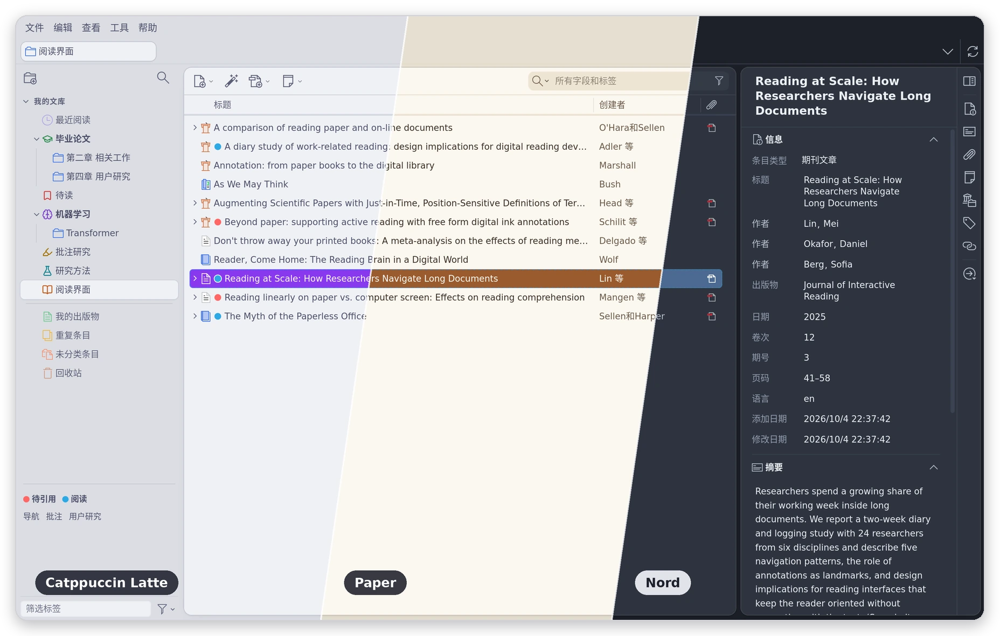
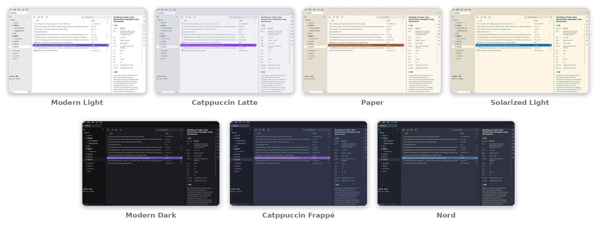
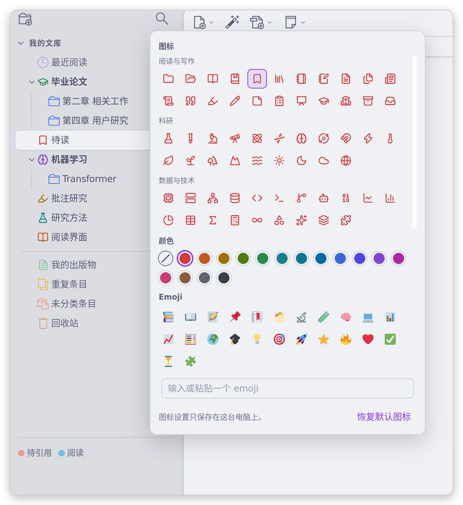
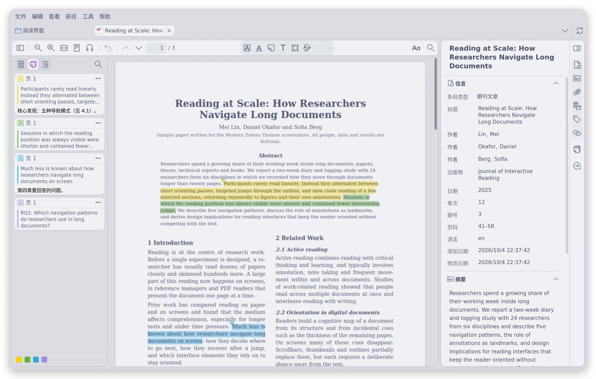
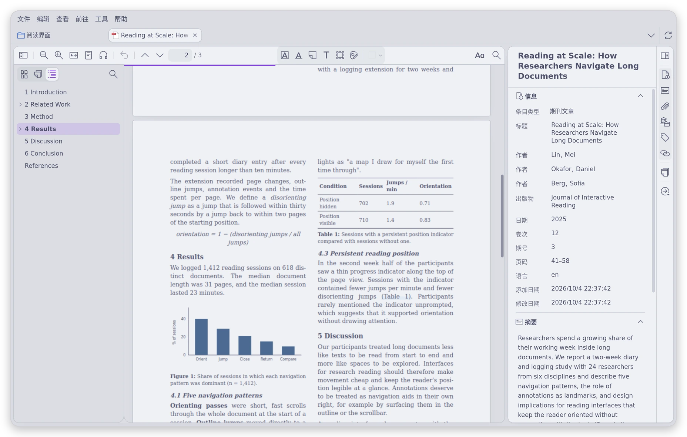
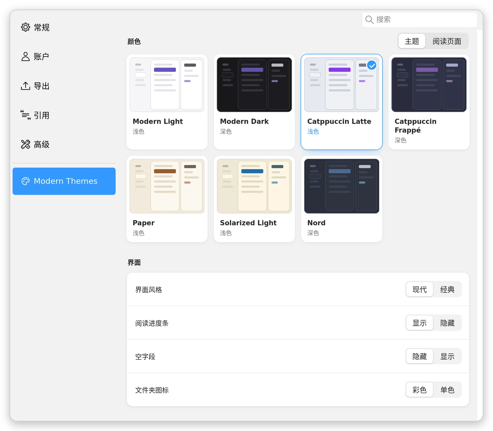

# Modern Zotero Themes

[English](README.md) | **简体中文**

适用于 Zotero 7–10 的现代主题插件。Zotero 的三栏、工具栏和使用方式保持不变。



## 功能

### 主题



### 现代界面风格

- 文献列表和详情面板是浮在底色上的两张圆角卡片。
- 胶囊标签页、填充式搜索框，详情面板留白更宽松。
- 没有内容的字段默认隐藏，编辑信息区时再显示。
- 想保留 Zotero 原来的布局？在设置中切换为“经典”，只换颜色。

### 分类树与自定义图标



- 文库名显示为分区标题，子文件夹带缩进竖线，回收站等系统项变淡。
- 在文件夹上右键 →“设置图标…”，可从 105 个线条图标（16 种颜色）或任意 emoji 中选择。
- 图标只保存在本机，不会同步。

### 阅读界面

 

- 工具栏、侧栏、批注卡片和弹窗使用主题配色。批注颜色不改动。
- 阅读页面：PDF/EPUB 页面可以用某个主题的底色和文字颜色，也可以保留 PDF 原本的颜色，或交给阅读器的 Aa 菜单决定（默认）。
- 阅读进度条：PDF 顶部一条细线。悬停显示页码，点击或拖动可跳转。

### 笔记编辑器

- 详情面板和阅读器侧栏里的笔记使用主题配色。
- 笔记内容和笔记里设置的颜色保持原样。

### 设置



- 用带预览的卡片选择主题和阅读页面，更改即时生效。
- Zotero 自身外观（设置 → 常规 → 外观）与主题深浅不一致时，会提示并可一键修正。

### 不会改动的内容

- 条目数据、标签和批注颜色。
- 列表的行高和列宽；行距沿用“视图 → 密度”。
- 独立的阅读窗口、笔记窗口和系统弹窗。

## 安装

1. 从 [Releases](https://github.com/xzhang001/modern-zotero-themes/releases) 下载最新的 `modern-zotero-themes-<版本>.xpi`。
2. 在 Zotero 中打开 工具 → 插件，点击齿轮图标，选择“从文件安装插件”。
3. 打开 Zotero 设置 → **Modern Themes**，选择主题。

之后 Zotero 会自动更新插件。要恢复 Zotero 原来的样子，停用插件即可。

原生检查项目见 [兼容性检查表](docs/compatibility.md)（英文）。

### Zotero 7

建议使用 Zotero 8 或更高版本。在 Zotero 7 中，以下功能不可用：

- 隐藏空字段。
- 分类树的分区标题，以及系统项变淡。
- 阅读页面颜色，因为 Zotero 7 的阅读器没有阅读主题。

## 开发

需要 Node.js 18+ 和 Python 3.10+，没有 npm 依赖。

```sh
npm test         # 运行测试
npm run build    # 构建 dist/*.xpi 并写入 updates.json
npm run preview  # 设计预览：http://localhost:5173/preview/
```

预览用 HTML 模拟 Zotero，仅供设计审阅，不能代替在 Zotero 中测试。

发布一个版本：

1. 修改 `plugin/manifest.json` 和 `package.json` 中的版本号，运行 `npm test` 和 `npm run build`。
2. 提交，打标签 `v<版本>`，只推送标签。
3. 在 GitHub 上为该标签创建 Release，上传 `dist/` 中的 XPI。
4. 推送 `main`。已安装的插件从 `main` 读取 `updates.json`，所以这一步放在最后。

## 扩展主题

主题定义在 `plugin/themes.js`，新增的主题会自动出现在设置中。参见 [主题设计约定](docs/themes.md)（英文）。

## 许可

[MIT](LICENSE)。

- 文件夹图标来自 [Lucide](https://lucide.dev)（ISC 许可）。
- [Catppuccin](https://catppuccin.com/palette/)、[Solarized](https://ethanschoonover.com/solarized/) 和 [Nord](https://www.nordtheme.com/) 使用官方色板，个别颜色为满足对比度做了调整。
- 第三方许可见 [THIRD_PARTY_NOTICES.md](plugin/THIRD_PARTY_NOTICES.md)。
- 本插件并非 Zotero、Catppuccin、Solarized 或 Nord 官方发布。
